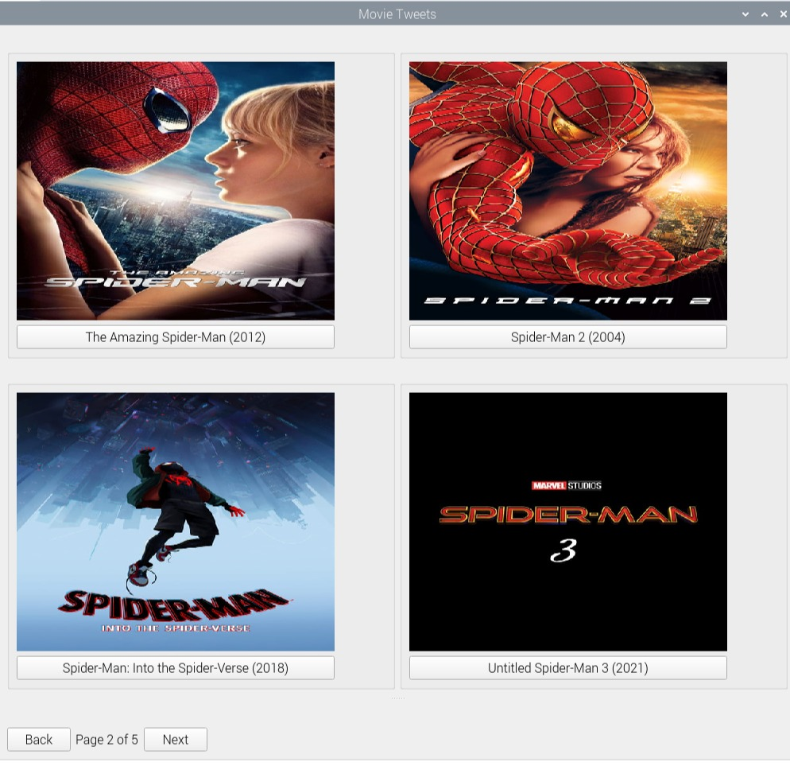
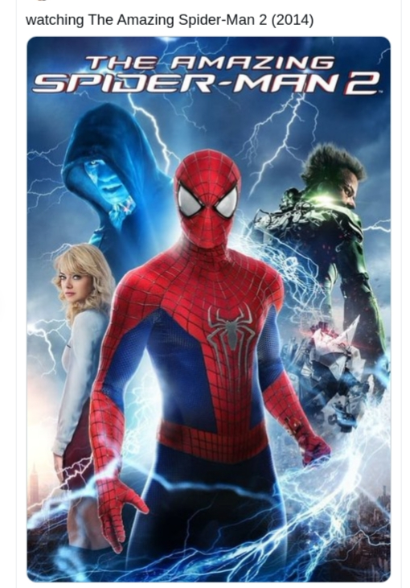

# movie-tweet
App that logs movies to Twitter.
## Running movie-tweet
```
git clone https://github.com/curtywill/movie-tweet.git
cd movie-tweet
python movie-tweet.py
```
## Pre-requisites
Only required libraries are Tweepy and PyQt5. An api key from https://www.themoviedb.org/ is also needed.
For the Tweepy functionality, apply for accesss to the Twitter API at https://developer.twitter.com/en/apps. After creating an app, look for ‘Keys and Access 
Tokens’ under the nav-panes and click on 'Generate Token Actions' and then copy your TMDB API Key, Consumer Key, Consumer Secret, Access Token, and Access Token
Secret into a config.py file in the following format:
```
api_key = "API KEY"
consumer_key = "CONSUMER KEY"
consumer_secret = "CONSUMER SECRET"
access_token = "ACCESS TOKEN"
access_secret = "ACCESS SECRET"
```
## Screenshots
* GUI Image
<p align="center">

</p>

* Tweet Image
<p align="center">


</p>
# Authors
* Curtiss Williams - cowilliams4@crimson.ua.edu
